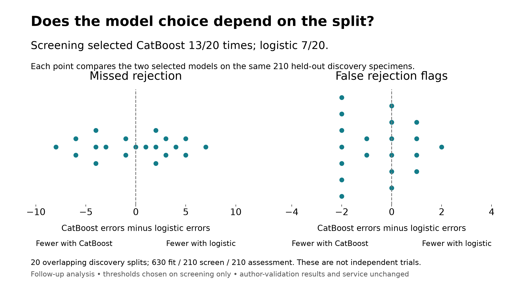

# Does the model choice depend on the development split?

This discovery-only follow-up selected CatBoost in **13 of 20** repetitions and logistic regression in **7 of 20**. The two family winners had identical screening false-flag counts in **5 of 20** repetitions; ROC-AUC broke those operating-point ties. The original model choice therefore should be explained with its split sensitivity, not as an established universal advantage of one algorithm.



## What changed between repetitions

Each repetition uses the same 1,050 discovery specimens with a new fixed diagnosis-stratified assignment: **630 fit / 210 screen / 210 assessment**. Screening chooses among three full-panel logistic regularization strengths (C = 0.01, 0.1, 1) and two CatBoost depths (4, 6; 300 trees). Both families use all 758 assay predictors. The shared preprocessing normalizes each specimen with its 12 housekeeping targets; logistic scaling learns only from its fit partition.

For each candidate, the threshold is the highest screening score retaining at least 90% of recorded rejection cases. Within a family and between family winners, selection maximizes screening specificity, then ROC-AUC. Exact ties favor stronger regularization, shallower trees, and finally logistic regression. Each selected fitted model stays paired with its screening threshold; there is no refit. Choices are saved before assessment predictions. Every repetition uses the same partitions for both families.

The design, candidate list and all 20 seeds were saved before fitting. We did not expand the experiment in response to results. The source archive is parsed and checked in full, then only discovery rows enter normalization, fitting or scoring. The 345 author-validation specimens are not evaluated in this follow-up.

## Errors on held-out discovery specimens

Each assessment has 210 specimens: 139–139 with rejection and 71–71 without. Entries below show the median across repetitions, with the 10th–90th percentile range in parentheses. Fractional error counts summarize repetitions; an individual repetition always has integer counts.

| Procedure | Missed rejection | False flags | Sensitivity | Specificity | Reached 90% sensitivity on assessment |
| --- | ---: | ---: | ---: | ---: | ---: |
| Logistic | 14.0 (9.7–19.1) | 3.0 (1.9–5.1) | 89.9% (86.3–93.0%) | 95.8% (92.8–97.3%) | 9/20 |
| CatBoost | 15.0 (8.0–21.1) | 2.0 (1.0–4.1) | 89.2% (84.8–94.2%) | 97.2% (94.2–98.6%) | 8/20 |
| Screening choice | 14.5 (9.0–21.1) | 3.0 (1.0–4.1) | 89.6% (84.8–93.5%) | 95.8% (94.2–98.6%) | 7/20 |

The screening sensitivity target is an experiment setting; it is not a guarantee for unseen specimens. The “Screening choice” row evaluates the model family chosen before that repetition's assessment was scored.

## Paired comparison

Subtracting logistic errors from CatBoost errors within each repeat holds assessment specimens fixed:

- Missed-rejection difference: **0.5 (-6.0–5.0)**.
- False-flag difference: **0.0 (-2.0–1.0)**.
- CatBoost misses fewer rejection cases in 9/20 repeats, ties in 1/20, and logistic misses fewer in 10/20.
- CatBoost makes fewer false flags in 9/20 repeats, ties in 6/20, and logistic makes fewer in 5/20.

The full threshold distributions, candidate choices, metric ranges and paired ROC-AUC differences are in [summary.json](summary.json). Threshold variation is descriptive: different fits can have different score scales, and these thresholds should not be transferred between fitted models.

## What this establishes

This tests the model-selection procedure with 630 fit specimens, fewer than the original frozen model's 787. It does not re-estimate that fitted service model's accuracy or replace its reported 345-specimen evaluation. The repeated partitions overlap; their percentiles are descriptive split variability, **not confidence intervals from independent trials**. No pooled specimen-level significance test is used.

The follow-up was proposed after existing evaluation results had been examined. It supplies another view of the development decision, not a new independent validation. Patient and center independence remain unverified. Batch-grouped splitting, assay-QC review and viral-target removal are separate proposed next steps.

For the talk, one figure and the selection counts are sufficient. Keep the frozen model as the demonstrated artifact and explain that logistic is a credible simpler alternative. This follow-up does not justify changing the frozen service by consulting its already-seen author-validation results.

## Reproduce and inspect

```powershell
uv run python -m experiments.rejection_stability.run --output-dir results/followup/new_stability --artifacts-dir data/processed/stability/new_stability
```

New destinations are required; completed runs are never overwritten. The command verifies both public input hashes before fitting. It uses the project lockfile and local Python 3.12 environment. The run took 639.3 seconds for 100 candidate fits; every saved candidate reproduced its screening scores within 1e-12 after reload.

- [Pre-fit design](design.json), [run manifest](run_manifest.json), and [source snapshot](source/)
- [Candidate screening metrics](screening_metrics.csv), [held-out assessment metrics](assessment_metrics.csv), [family choices](selections.csv), and [paired differences](paired_differences.csv)
- [Editable SVG](model_choice_stability.svg), [PNG](model_choice_stability.png), and the saved CSVs supply editable evidence for a slide.
- Per-specimen assignments/predictions and model binaries are local, Git-ignored artifacts under `data/processed/stability/20260917_stability`. Model identities and all artifact hashes are recorded in the run manifest.
